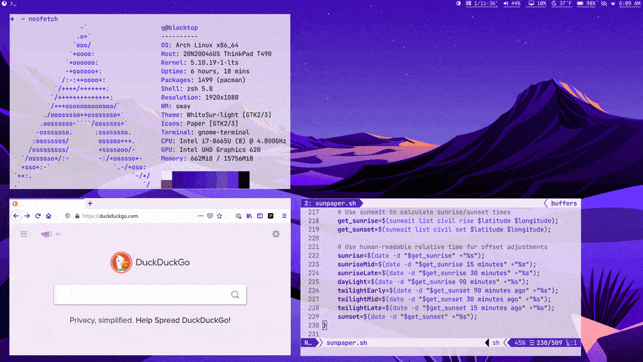
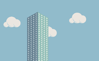

## Sunpaper

Sunpaper is a small utility to change wallpaper based on local sunrise and sunset times. 

It works with several modified [dynamic themes](#wallpaper-previews) to move through eight images depending on the position of the sun at your location and time of year.

Compatible with any linux distribution and window manager (X or wayland).

## Features

- [x] Changes wallpaper based on the sun location where you are
- [x] Sets a day/night wallpaper with 3 additional transitions for each sunrise/sunset
- [x] 6 wallpaper themes to choose from ([previews](#wallpaper-previews))

## Optional Extras

- [x] [Darkmode](https://github.com/hexive/sunpaper/wiki/Darkmode) - run external scripts on a day/night trigger
- [x] [Pywal mode](https://github.com/hexive/sunpaper/wiki/Pywal-Mode) - get on-the-fly color scheme changes for each wallpaper change.
- [x] [Waybar mode](https://github.com/hexive/sunpaper/wiki/Waybar-Mode) - display icon and transition report as tooltip
- [x] [Sway/Oguri mode](https://github.com/hexive/sunpaper/wiki/Sway-Oguri-Mode) - no-flash wallpaper changes in sway

## TODO

- [ ] More original content FOSS wallpaper themes
- [ ] More custom status bar modes  
- [ ] Moon phases?  
- [ ] Weather?!

## Install

Check the [wiki](https://github.com/hexive/sunpaper/wiki) for full documentation about install, configuration, tips & tricks, etc
1. [Install](https://github.com/hexive/sunpaper/wiki/Install) 
1. [Configure](https://github.com/hexive/sunpaper/wiki/Configure) 
1. [Test it](https://github.com/hexive/sunpaper/wiki/Test-it) 
1. [Set it to run automatically](https://github.com/hexive/sunpaper/wiki/Set-it-to-run-automatically) 

## Why Sunpaper?

Dynamic wallpapers are awesome, but transitions are usually based on static timetables. I wanted something that could adapt to sunrise and sunset changes over the year without any input from me. The idea is to as closely recreate the Apple Big Sur Dynamic Desktop behavior as possible.

## Wallpaper Previews

Wallpaper images are not mine, they are from the following sources:

### from Apple Big Sur (6016x6016)

|The Desert|The Lake|The Cliffs|The Beach|
|--|--|--|--|
|||||

### from Blake Watson: (2880x1800) 
[https://blakewatson.com](https://blakewatson.com)  
Adapted for sunpaper, with permission, from Blake's [Corporate Sunrise](http://simpledesktops.com/browse/desktops/2015/feb/26/corporate-sunrise/) and Corporate Nights Wallpapers.

|Corporate Synergy|
|--|
||

### from Louis Coyle: (7680x3214) 
[https://dribbble.com/louiscoyle](https://dribbble.com/louiscoyle)

|Lakeside|
|--|
||
