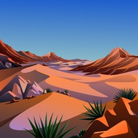
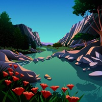
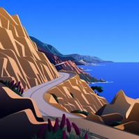
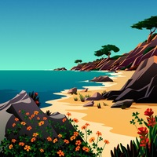

## Sunpaper

Sunpaper is a small utility to change wallpaper based around your local sunrise and sunset times. 

It works with several modified [dynamic themes](#wallpaper-previews) to change your wallpaper 8 times throughout the day depending on the position of the sun at your location and time of year.

## Features

- [x] Changes wallpaper based on the sun location where you are
- [x] Sets day/night wallpaper with 3 additional transitions for each sunrise/sunset
- [x] 5 wallpaper themes to choose from ([previews](#wallpaper-previews))
- [x] Pywal mode to set color schemes with each wallpaper change
- [x] Darkmode trigger to run external script at day/night
- [x] Waybar mode to display icon and sun time report on tooltip

## TODO

- [ ] New original content FOSS wallpaper themes
- [ ] More custom status bar modes 

## Why Sunpaper?

Sunpaper was developed to replicate the behavior of Apple Dynamic Desktop wallpapers. The Big Sur minimal wallpapers are beautiful and I wanted to use them on my linux machines. There are many other timed wallpaper utilities out there, but they all seemed to be using static timetables for the wallpaper changes. I wanted something that could be directly tied to the sunrise/sunset times locally and adapt to changes over the year without any fiddling on my part.

## Documentation: [[Install]](https://github.com/hexive/sunpaper/wiki/1-Install) [[Configure]](https://github.com/hexive/sunpaper/wiki/2-Configure) [[Test]](https://github.com/hexive/sunpaper/wiki/3-Test-it) [[Automate]](https://github.com/hexive/sunpaper/wiki/4-Set-it-to-run-automatically) [[Wiki]](https://github.com/hexive/sunpaper/wiki)

## Wallpaper Previews

Wallpaper images are not mine, they are from the following sources:

### from Apple Big Sur (6016x6016)

|The Desert|The Lake|The Cliffs|The Beach|
|--|--|--|--|
|||||

### from Louis Coyle: (7680x3214) 
[https://dribbble.com/louiscoyle](https://dribbble.com/louiscoyle)

|Lakeside|
|--|
||
